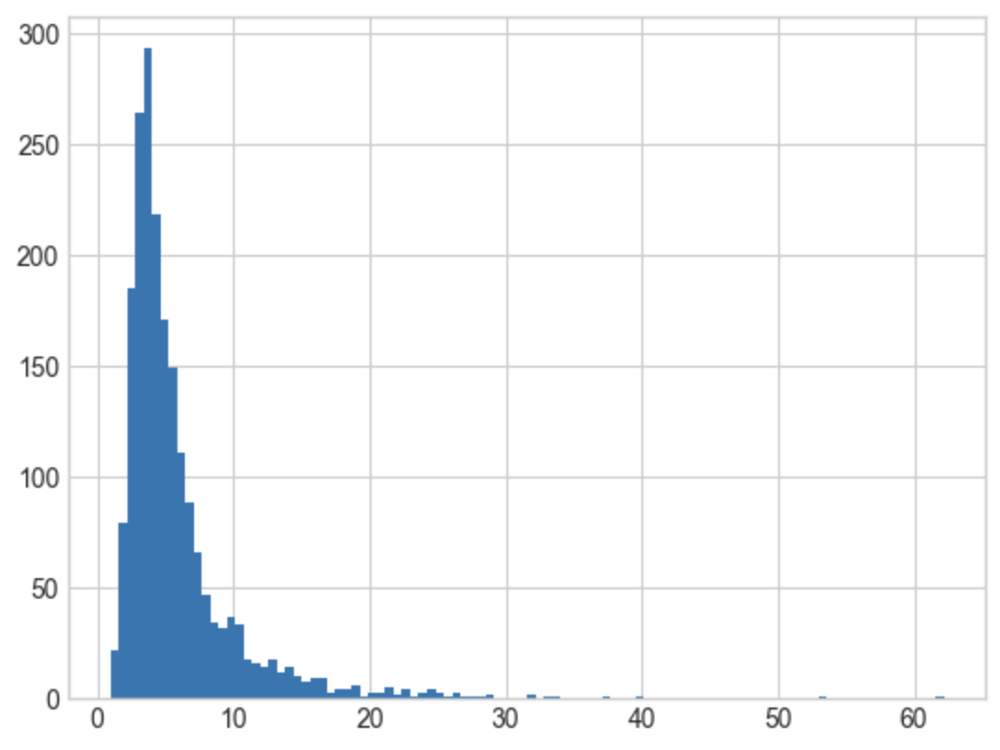
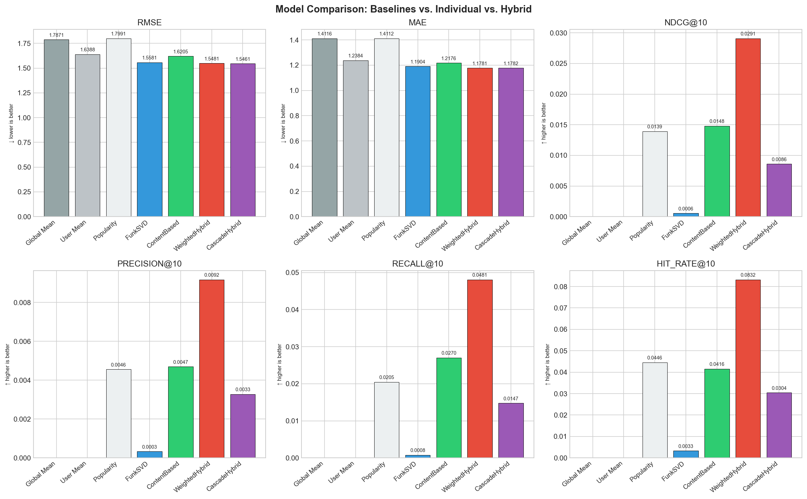
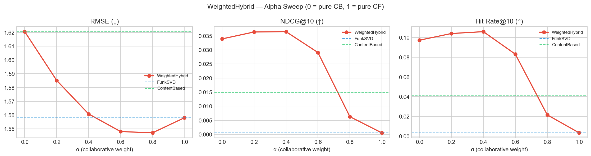
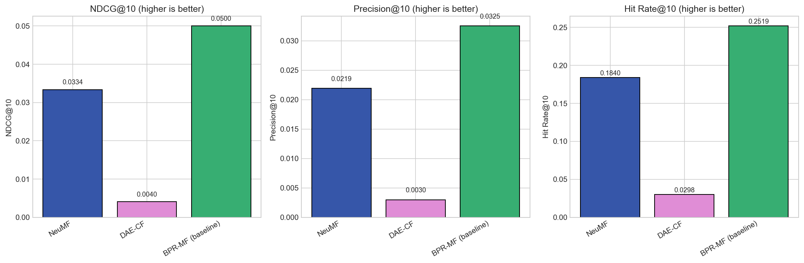
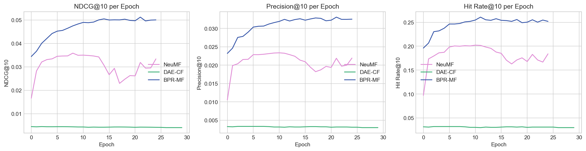
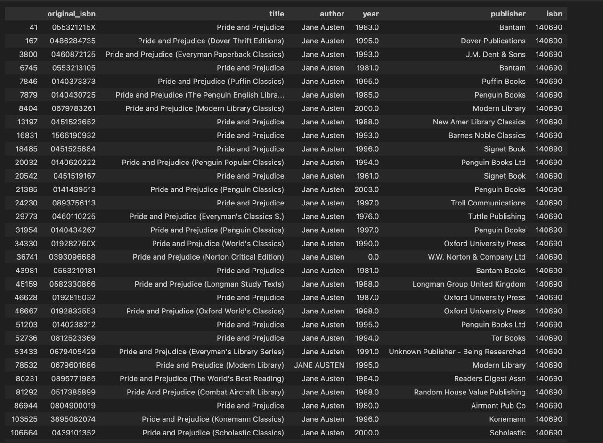

# Recommender Systems (part 2)

GitHub: https://github.com/adrianaSluka/rec_sys_ucu_2026/tree/adriana/matrix-factorization

Dataset: **Book Crossing Dataset**

Team: Placeholder

- Adriana Sluka
- Nazar Protsiv

## Ranking Heuristics & Graph-Based Signals

For ranking heuristics mix of popularity and recency-based ranking was used: final score is the number of book occurences in train set, weighted with time decay factor

$$
2^{-\Delta t / h}
$$

where h is half-life factor and equals 30 days. This way we penalize older ratings and assign more relevance to newer ones.

histogram of scores for popularity-based ranking heuristics

top-5 books. implicit_style is basically a counter of how many times book appeared in dataset with rating > 0

For graph-based approach we calculate edges between books as number of times two books were rated by the same user with cosine normalization, to compensate for popularity factor.

Example of pairs for graph-based approach with largest edge weights

Popularity based with recency decay ranking assumes that items, that many people interacted with in recent time are more relevant for all users. Recommendations are the same for all users, personalization happens only after items user has already rated are removed from suggestions, which inherently makes it strong solution for cold-start problem for users without history or very sparse profiles. However, its lack of personalization is a big problem itself, especially when preferences are heterogeneous. Also, it creates a problem of popular items getting more popular and long-tails get suppressed, that leads to cold-start problem for new items.

Graph-based ranking assumes that items that co-occur in users' histories are similar, which makes it a kind of item-based colaborative filtering. This method contains personalization element as opposed to popularity based ranking heuristic. However it also faces item cold-start problem. Also, without normalization risks of popular items becoming hubs, that after scoring dominate in recommendations.

Based on resulting metrics (NDCG@10, Precision@10, Hit Rate@10) we see that in all methods outperform MF and similarity based approaches. min1 and min6 on plots stand for relevance threshold used for test data. Methods are resistent for relevance threshold and a conclusion that can be made is that they moslty recommend items, that have higher rating to users. Though NDCG@10 and Precision@10 are still pretty low, Hit Rate@10 gets up to 0.27 with graph-based methods and 0.2 with ranking heuristics, meaning that each fourth and fifth user accordingly get 1 relevant item from 10 generated recommendations.

## Learning-to-Rank with Pairwise Optimization

Bayesian Personalized Ranking learns relative preferences of users and does it with pairwise loss: for each user two items are chosen, one with some interaction is considered positive and second is the one, that user haven't seen, is considered negative. 3 strategies to choose these negative examples are suggested and tested: uniform negatives, popularity-based negatives (more popular items are sampled more often) and mixed.

Each combination user-positive and user-negative is scored via dot product with bias. As positive pair should have higher score than negative, difference $x_{upn} = s(u_p) - s(u_n)$ should be positive. BPR uses a logistic probability that the ordering is correct via sigmoid, so optimization objective is to minimize negative log-likelihood: $\mathcal{L}_{uij} = -\log \sigma(x_{upn})$. L2-regularization is used for embeddings matrices representing users and items and biases, so that the model doesn't overfit.

model was trained for 25 epochs

Bayesian Personalized Ranking performs on the level of graph-based approach with all metrics slightly lower:

- NDCG@10 (0.05 vs 0.07)
- Precision@10 (0.0325 vs 0.0446)
- Hit Rate@10 (0.25 vs 0.27)

Best strategy for negative pairs sampling is Uniform, where all entries are treated with equal probability to be chosen. This might happen for a few reasons:

- sampling negatives proportional to popularity will often pick books user might plausibly like, because in sparse data unseen ≠ disliked.
- popularity sampling can push model toward anti-popular behaviour

Though train loss shows positive convergence dynamics, test NDCG@10, Precision@10 and Hit Rate@10 reach its plateaus at approximately 5th-10th epochs, indicating overfit.

**Impact on head vs tail items.** BPR with uniform negative sampling has the best catalog coverage (0.77) among all models, meaning it exposes a wider range of items including the long tail. Popularity-based negative sampling systematically penalizes popular items, producing anti-popular recommendations and reduced coverage. This confirms that the choice of negative sampling strategy directly controls the head/tail trade-off: uniform sampling is more tail-friendly, while popularity sampling may be used deliberately to surface niche items at the cost of recommendation quality.

## Hybrid Recommender Systems

Two hybrid strategies were implemented combining FunkSVD (collaborative signal) and Content-Based filtering (content signal):

**Weighted Hybrid** blends normalized CF and CB scores at the score level:

$$
\text{score}(u, i) = \alpha \cdot \text{CF}(u, i) + (1 - \alpha) \cdot \text{CB}(u, i)
$$

with min-max normalization per model before blending to prevent scale dominance. Both sub-model score tables are precomputed after training for O(1) inference.

**Cascade Hybrid** uses a two-stage pipeline: Content-Based generates a candidate pool of 300 items, which FunkSVD then reranks. The rationale is that CB provides recall for less popular items the CF model may miss, while FunkSVD provides personalized precision within that pool.

The dataset used for hybrid experiments was the min-5 filter split: 6,792 users, 8,985 items, with 85,206 train and 17,503 test ratings (temporal 80/10/10 per-user split). Sub-models alone show very limited ranking ability:

| Model | NDCG@10 | Precision@10 | Hit Rate@10 |
|---|---|---|---|
| FunkSVD | 0.0006 | — | 0.0033 |
| ContentBased | 0.0148 | — | 0.0416 |

Combining signals improves ranking substantially:

| Model | RMSE | NDCG@10 | Precision@10 | Hit Rate@10 |
|---|---|---|---|---|
| WeightedHybrid (α=0.6) | 1.5481 | **0.0291** | 0.0092 | **0.0832** |
| CascadeHybrid | 1.5461 | 0.0086 | 0.0033 | 0.0304 |

An alpha sweep over α ∈ {0.0, 0.2, 0.4, 0.6, 0.8, 1.0} shows that α=0.6 (60% CF, 40% CB) is optimal for NDCG@10 and Hit Rate@10. Pure CF (α=1.0) collapses to near-zero ranking performance—the known FunkSVD dot-product collapse issue where predictions are dominated by bias terms and become effectively popularity-ranked. Pure CB (α=0.0) is better but still weaker than the blend.

**Why this hybrid structure.** FunkSVD alone produces near-identical top-K lists for all users (collapsed embeddings), so the content signal acts as a regularizer that injects item-level diversity. The content feature space (book metadata) provides signal that is orthogonal to co-occurrence patterns, which helps for items with sparse interaction history.

**Who benefits.** Users with a clear genre or author preference gain the most from the content signal, as CB can surface thematically similar items the CF model would rank low due to low popularity. Cold items (only 2 in test, ~0% of test ratings) see marginal gains; the main beneficiaries are users in the medium-activity range who have enough history for personalization but whose preferred items are long-tail.

**CascadeHybrid underperforms** despite the reasonable architectural motivation. The likely cause is that the CB candidate pool at N=300 is too restrictive: if the truly relevant items for a user are not in the CB top-300, FunkSVD reranking cannot recover them. The cascade design is sensitive to recall at stage 1.

## Classical Deep Learning for Recommendation

Two neural architectures were implemented and evaluated against BPR-MF as baseline, all on the min-10 filter dataset (1,810 users, 2,020 items, train 28,144 ratings).

### Neural Matrix Factorization (NeuMF)

NeuMF (He et al., 2017) extends standard MF by combining two interaction branches:

- **GMF branch**: element-wise product of user and item embeddings (32 factors each), capturing linear MF-style interactions
- **MLP branch**: concatenated embeddings (32+32) passed through ReLU layers [64→32→16], learning non-linear patterns
- **Fusion**: final score $= w^T [\text{gmf\_out}; \text{mlp\_out}] + b$

Training uses BPR pairwise loss with 200,000 triplets per epoch, batch size 2048, lr=0.01, reg=1e-4, gradient clipping ±5.0. Separate embedding tables for GMF and MLP branches.

### Denoising Autoencoder (DAE-CF)

DAE-CF (Wu et al., 2016 / Sedhain et al., 2015) takes a user's full interaction vector $r_u \in \mathbb{R}^{|I|}$ as input, corrupts 30% of observed entries to zero, then reconstructs all ratings:

$$
\hat{r}_u = W_d \cdot \text{ReLU}(W_e \cdot \tilde{r}_u + b_e) + b_d
$$

Loss is masked MSE computed only on observed entries (unobserved weight = 0). Hidden dimension is 256, trained for 30 epochs, batch size 128. Unlike MF, the user representation is amortized—it is computed from the interaction row at inference time, not stored as a fixed latent vector.

### Results

| Model | NDCG@10 | Precision@10 | Hit Rate@10 | Catalog Coverage@10 |
|---|---|---|---|---|
| BPR-MF (baseline) | **0.0500** | **0.0325** | **0.2519** | **0.7708** |
| NeuMF | 0.0334 | 0.0219 | 0.1840 | 0.2822 |
| DAE-CF | 0.0040 | 0.0030 | 0.0298 | 0.5837 |

### Discussion

**Why BPR-MF wins despite having less capacity.**  With only 1,810 users and 2,020 items and extreme sparsity, the dataset provides insufficient signal for the extra parameters in NeuMF and DAE-CF. BPR-MF has O(d · (|U| + |I|)) parameters; NeuMF doubles this with separate GMF/MLP embeddings plus MLP weights. On sparse data, the MLP's non-linearities introduce variance that the data cannot correct.

**NeuMF vs BPR-MF (representational difference).**  BPR-MF models user-item affinity as a bilinear form $p_u^T q_i$—a linear inner product in latent space. NeuMF's MLP branch can in principle learn more expressive interaction functions, but this advantage materializes only when there are dense, diverse co-occurrence patterns to exploit. The Book Crossing dataset, with median user activity of ~10 ratings, cannot support this.

**DAE-CF struggles most** because it reconstructs the entire interaction row from a corrupted version. With ~14 observed interactions per user on average (28,144 / 1,810), the encoder must generalize from very few active dimensions, and the denoising objective blurs the limited signal further. Catalog coverage is higher (0.58) because the reconstruction spread activates a broader item distribution, but quality is low.

**Optimization trade-offs.**  NeuMF training takes roughly 4× longer than BPR-MF due to larger parameter count and the two-branch forward pass. DAE-CF is the slowest per epoch because it operates on full interaction vectors (|I|=2020 dimensional inputs) for each user batch. Neither provides quality gains that justify the compute overhead on this dataset size.

**Convergence.**  NeuMF's NDCG@10 improves in early epochs (1–15) then plateaus, similar to BPR overfitting behavior. DAE-CF validation metrics remain flat throughout training, suggesting the reconstruction objective and ranking objective are misaligned: the model learns to reconstruct observed ratings accurately while failing to produce discriminative rankings.

## Online Evaluation: A/B Testing & Bandits

Let's imagine that we are building recommendation system for some online book-platform, like Headway app and decide to test new recommender system, which promises to perform better.

The most secure unit of randomization is user, because user's experience will stay consistent through his platform usage, as opposed to session randomization. Consistency will secure clean results of A/B test.

Obviously, main goal for each product is to increase incomes, which is achieved by improving users' experience with that product. So decision about whether A/B test will be rolled out will be made by some business metric, like conversion to payment or ARPU.

But testing recommender systems takes more time, as book reading is pretty long process and obtaining results of our recommendation will be prolonged in time and that time is indefinite. Therefore, main health metrics should be something that delivers reaction fast and is easily interpretable. For example, click-through-rate (CTR), click on "want to read" button (or smth like that, this button should be the same in both groups), average time spent on book page (this will show whether users spend more time in reading some information about book), average session length, daily retention. If we see positive changes in these metrics, we should keep A/B test running and if they drop significantly - stop test.

Testing rec sys possesses few additional risks:

1. novelty effect - this risk is mostly relevant for returning users, because they experience a change compared to what they were used to. To mitigate it, we should track health metrics dynamically by "days since assignment" (e.g., CTR and average time spent on the book page for day 0…day 30, retention d1…d30). New users will not experience novelty effect, as they have no prior knowledge about original recommendation system.
2. position bias - items that appear on top of the page will be more engaged with. To have better understanding where new recommender system performs better - in the beginning of the list or on the whole list, metrics such as CTR@1, CTR@3 … CTR@10 should be used.
3. feedback loops - If we start retraining the model using interaction data collected under the new policy (group B), we may create a self-reinforcing loop: the recommender changes exposure, which changes interactions, which then biases future training data—potentially amplifying popularity and reducing exploration. To control for this, we should monitor the item exposure distribution (head vs long tail) and introduce controlled exploration/randomization so that long-tail items are not systematically ignored.

## Final System-Level Synthesis

### Offline vs Online Discrepancies

Offline evaluation in this project is based on held-out historical interactions from a static temporal split. This conflates two sources of noise: (1) users only rated books they chose to read, introducing selection bias toward already-popular titles; (2) unobserved interactions are treated as negatives, but in a sparse dataset (99.99% sparsity) most unobserved pairs reflect lack of exposure, not genuine dispreference.

The consequence is that models optimized offline for NDCG@10 or Hit Rate@10 will be biased toward recommending popular, widely-seen items. This explains why BPR-MF with uniform negative sampling achieves both the best offline ranking metrics and the best catalog coverage—it is indirectly penalizing the popularity bias inherent in naive training.

The key offline-online discrepancy to anticipate: items the offline model never recommended (due to low historical frequency) may be highly relevant to specific users. Online metrics such as CTR and engagement will capture this; offline metrics will not.

### Deployment Choice and Justification

For an initial production deployment, **BPR-MF with uniform negative sampling** is the recommended choice. Justification:

- Best offline ranking metrics across consistent dataset splits
- Highest catalog coverage (0.77), reducing popularity concentration
- Fast inference (O(d) dot product per user-item pair)
- Interpretable failure modes (embedding collapse detectable, coverage monitorable)
- Low computational overhead for retraining on new interaction data

The WeightedHybrid (CF + CB) is a strong candidate for a second iteration once content features are properly validated. It showed the best Hit Rate@10 in the min-5 filter experiments and is the only model that partially addresses the item cold-start problem through the content signal.

### Iteration Strategy Post-Deployment

1. **Week 1–2**: Shadow mode. Log BPR-MF recommendations alongside the current system. Compare distributions of recommended items and overlap with user history.
2. **Week 2–6**: A/B test against current baseline using CTR and "want to read" clicks as primary metrics, ARPU as guardrail. Monitor novelty effect by "days since assignment."
3. **After A/B test**: If positive, full rollout with continued monitoring of catalog exposure distribution (head/tail split) and user retention by activity segment (cold users, medium, heavy).
4. **Model updates**: Retrain weekly on rolling window of recent interactions. Monitor for feedback loop amplification by tracking item exposure Gini coefficient over time.
5. **Next model**: Introduce WeightedHybrid for cold-start users (fewer than 5 interactions) while keeping BPR-MF for active users.

### Key Failure Modes to Monitor

**Embedding collapse**: FunkSVD and BPR-MF can degenerate where the dot product becomes dominated by bias terms, producing near-identical rankings for all users. Monitor per-user recommendation overlap: if the top-10 lists for >30% of users are identical, embedding collapse has occurred.

**Popularity concentration**: Track the Gini coefficient of item exposure in recommendations weekly. A rising Gini indicates the model is amplifying popularity bias, suppressing tail items and creating a cold-start feedback loop for new content.

**Cold-start degradation**: Monitor recommendation quality separately for users with <5, 5–20, and >20 interactions. BPR-MF has no content fallback; new users will receive popularity-driven recommendations that may not reflect their preferences.

**Feedback loop**: After each model retrain, compare item exposure distributions before and after. If retraining amplifies exposure concentration, introduce a controlled exploration budget (e.g., 10% of recommendations from a diversity-sampled pool).

**Position bias drift**: If CTR@1 grows while CTR@5–10 stays flat, users are increasingly click-satisficing on the first result. Monitor rank-stratified CTR to ensure recommendations are valuable across the list, not just the top position.

## Additional note

During assignment we found one problem in data: the older and the more popular book is, the larger chance of its duplicate occuring due to republishing. This is not an obvious problem before you explicitly face it, so unfortunately it was detected pretty late and we didn't address it anyway in first part of project. Example below:

For deduplication we created canonical names that removes everything in parenthesis and punctuation and put titles to lowercase. It handles large portion of duplicates, yet leaves some out. After that, 24685 out of 235547 (~10%) of books were regarded as those that have more than 1 publication.

This problem can be viewed from two perspectives:

1. we know that these books are the same at its core, so it would be correct to review them as one book for all users
2. yet, different publications in different years could have differ: some of those editions are aesthetically pleasing, with a lot of effort put into covers and illustrations, which could also influence the rating. Also, sometimes newer editions of the book might contain changes suggested by the author himself.

Consequently, this is not a pure bug, so to speak.

Interestingly enough, after we implemented some of the algorithms on deduplicated dataset, we witnessed significant drop in ranking metrics. We decided to run final experiments on original data, so that results are comparable with part 1, but to present key finding in additional notes section.

Deduplicating increased sample size dramatically: with constraint for minimum of 10 user ratings and 10 items rating, unique users number increased from 1810 to 12497. However, with heuristics ranking and BPR, metrics dropped drastically.

Additionally, to train BPR we increased number of epochs, yet it didn't show improvement.

Main explanation for such degradation of the results is that:

1. books that are often republished can be considered classics, so a lot of people read them, which creates popularity bias when all of them are mixed into one book
2. when these books are disconnected, more chances to be recommended go to long-tail books and recommendations artificially get more personalized
3. dataset grows → becomes more sparse and performance drops
